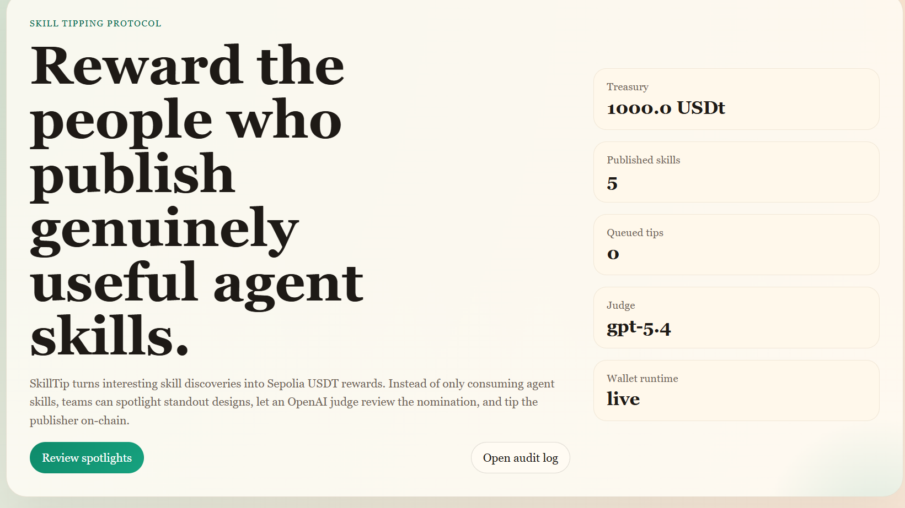
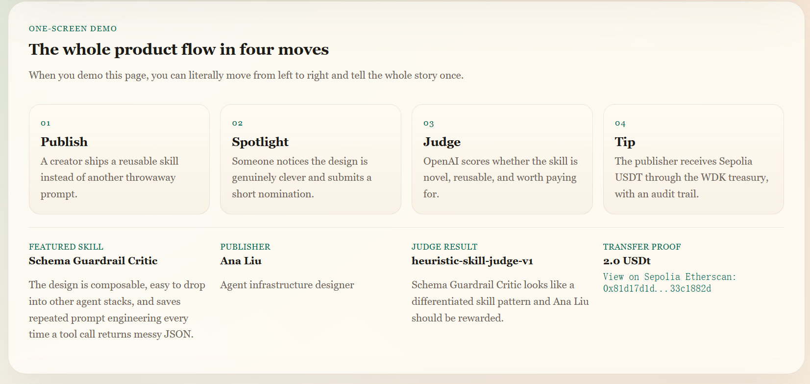

# SkillTip

Autonomous onchain rewards for high-signal AI skill publishers.

SkillTip is an agentic reward system that discovers interesting agent skills, evaluates whether they are genuinely reusable and differentiated, and pays the publisher in Sepolia USDT through a self-custodial WDK treasury.

Instead of treating skills as free infrastructure with no upside for creators, SkillTip turns discovery into programmable payout.



## Live Product Story

1. Creators publish reusable skills.
2. A discovery agent scans repo activity, workflow usage, reuse signals, and feed saves.
3. Spotlight candidates are generated automatically.
4. OpenAI plus policy constraints decide whether a reward should be issued.
5. WDK settles value onchain in Sepolia USDT.
6. If the creator had no wallet bound, the payout enters `pending_claim` and is automatically released after wallet binding.

## Features

- Autonomous discovery agent for skill feeds, repo signals, and usage signals
- Manual and agent-generated spotlight candidates
- OpenAI-based reward judgment with heuristic fallback
- Policy-controlled treasury allocation
- WDK-powered Sepolia USDT payouts
- Pending-claim release after wallet binding
- Audit log and transfer ledger
- Explorer links to Sepolia Etherscan

## Screens

### One-screen demo flow


### Program, treasury, and reward policy



### Publishing and nomination workflow


## Architecture

```text
                           ┌────────────────────────────┐
                           │       SkillTip UI          │
                           │   Next.js dashboard        │
                           └─────────────┬──────────────┘
                                         │
                         server actions / REST endpoints
                                         │
      ┌──────────────────────────────────┼──────────────────────────────────┐
      ▼                                  ▼                                  ▼
┌───────────────┐                ┌────────────────┐                ┌─────────────────┐
│ Discovery     │                │ Reward Judge   │                │ Policy Engine   │
│ Agent         │                │ OpenAI / local │                │ budgets, caps,  │
│ scans signals │                │ heuristic      │                │ thresholds       │
└──────┬────────┘                └────────┬───────┘                └────────┬────────┘
       │                                  │                                  │
       └──────────────────────────┬───────┴──────────────────────────────────┘
                                  ▼
                        ┌────────────────────┐
                        │  SkillTip Core     │
                        │  spotlight / tip   │
                        │  orchestration     │
                        └─────────┬──────────┘
                                  │
                                  ▼
                        ┌────────────────────┐
                        │ WDK EVM Treasury   │
                        │ Sepolia USDT       │
                        └─────────┬──────────┘
                                  │
                                  ▼
                        ┌────────────────────┐
                        │  Sepolia chain     │
                        │  + Etherscan       │
                        └────────────────────┘
```

## Why This Matters

AI skill ecosystems have a monetization gap:

- builders reuse skills
- teams derive value from them
- publishers often earn nothing

SkillTip treats discovery itself as an economic trigger.  
The system does not reward hype or popularity alone. It rewards skill designs that show real signs of reuse, differentiation, and utility under policy constraints.

## What Makes It Agentic

SkillTip is more than a dashboard with a pay button.

It now has an actual autonomous loop:

- scans signals without waiting for a human nomination
- generates spotlight candidates automatically
- can auto-approve rewards when policy allows it
- manages treasury allocation under explicit constraints
- persists decisions and payouts for inspection

This makes it much closer to “agents as economic infrastructure” than a simple review tool.

## Tech Stack

| Layer | Technology |
| --- | --- |
| Frontend | Next.js 16, React 19, TypeScript |
| Wallets | `@tetherto/wdk`, `@tetherto/wdk-wallet-evm` |
| AI Judge | OpenAI-compatible endpoint, default `gpt-5.4` |
| Chain | Ethereum Sepolia |
| Asset | Sepolia USDT |
| Storage | Local JSON event store for demo portability |
| Testing | Vitest |

## Repository Layout

- [app/page.tsx](/Users/jiahuaiyu/develop/hackthon/ResolveTip/app/page.tsx): dashboard entry
- [app/audit/page.tsx](/Users/jiahuaiyu/develop/hackthon/ResolveTip/app/audit/page.tsx): reward ledger and audit trail
- [components/dashboard.tsx](/Users/jiahuaiyu/develop/hackthon/ResolveTip/components/dashboard.tsx): main product UI
- [components/forms.tsx](/Users/jiahuaiyu/develop/hackthon/ResolveTip/components/forms.tsx): publish, bind, discover, reward actions
- [lib/discovery-agent.ts](/Users/jiahuaiyu/develop/hackthon/ResolveTip/lib/discovery-agent.ts): autonomous discovery logic
- [lib/openai-judge.ts](/Users/jiahuaiyu/develop/hackthon/ResolveTip/lib/openai-judge.ts): model-based reward evaluation
- [lib/resolvetip.ts](/Users/jiahuaiyu/develop/hackthon/ResolveTip/lib/resolvetip.ts): core orchestration and pending-claim settlement
- [lib/wallet.ts](/Users/jiahuaiyu/develop/hackthon/ResolveTip/lib/wallet.ts): WDK transfer execution
- [data/demo-state.json](/Users/jiahuaiyu/develop/hackthon/ResolveTip/data/demo-state.json): seeded demo state

## API Routes

- `GET /api/skills`
- `POST /api/skills`
- `GET /api/spotlights`
- `POST /api/spotlights`
- `POST /api/spotlights/:spotlightId/reward`
- `POST /api/creators/:creatorId/wallet`
- `POST /api/discovery/run`

## Quick Start

### Prerequisites

- Node.js 18+
- npm
- a Sepolia RPC endpoint if you want live payouts
- a WDK seed phrase if you want live treasury execution
- an OpenAI-compatible API key if you want model judging

### 1. Install

```bash
npm install
```

### 2. Configure environment

Copy `.env.example` to `.env` and set the values you need.

Important variables:

```bash
APP_BASE_URL=http://localhost:3000
RESOLVETIP_WALLET_MODE=mock
RESOLVETIP_CHAIN=sepolia
RESOLVETIP_TREASURY_INDEX=0

OPENAI_API_KEY=
OPENAI_API_URL=https://api.openai.com/v1/responses
OPENAI_MODEL=gpt-5.4

WDK_SEED_PHRASE=
WDK_INDEXER_API_KEY=
WDK_INDEXER_API_URL=https://wdk-api.tether.io

SEPOLIA_RPC_URL=
SEPOLIA_CHAIN_ID=11155111
SEPOLIA_USDT_ADDRESS=0xd077A400968890Eacc75cdc901F0356c943e4fDb
ERC20_DECIMALS=6
```

Optional local proxy support:

```bash
HTTPS_PROXY=http://127.0.0.1:7898
HTTP_PROXY=http://127.0.0.1:7898
```

### 3. Run locally

```bash
npm run dev
```

Open `http://localhost:3000`.

## Modes

### Mock mode

Use mock mode when you want a clean, safe demo:

- no live chain dependency
- mock transfer receipts
- full agent workflow still visible

```bash
RESOLVETIP_WALLET_MODE=mock
```

### Live Sepolia mode

Use live mode when you want real testnet payouts:

- treasury derives from `WDK_SEED_PHRASE`
- reward execution uses Sepolia USDT
- explorer links point to `sepolia.etherscan.io`

```bash
RESOLVETIP_WALLET_MODE=live
```

## Real Sepolia Smoke Test

```bash
npm run smoke:sepolia -- --recipient 0xYourSepoliaAddress --amount 0.01 --index 0
```

This script:

- derives the WDK treasury account
- checks Sepolia USDT balance
- sends a real transfer
- optionally verifies it via the WDK Indexer

## Demo Walkthrough

### Short hackathon demo

1. Open the homepage.
2. Explain the one-screen flow.
3. Click `Run discovery agent`.
4. Open a queued or agent-discovered spotlight.
5. Click `Review and tip publisher`.
6. Show `Recent rewards`, `Transfer receipts`, and the Etherscan link.
7. Open `/audit` and show the evaluation trail.

### Full demo

1. Bind a creator wallet.
2. Publish a skill.
3. Submit a spotlight.
4. Run the discovery agent.
5. Trigger a reward.
6. Show the audit trail.

## Pending Claim Release

If a reward is approved before a creator binds a wallet:

- the transfer is recorded as `pending_claim`
- the reward remains visible in the ledger
- once the creator binds a wallet, SkillTip automatically releases the pending payout
- transfer, spotlight, and audit state are updated automatically

## Testing

```bash
npm test
npm run build
```

Current test coverage includes:

- reward core and policy behavior
- autonomous discovery generation
- mock reward execution
- pending claim release after wallet binding

## Notes

- Live payout quality depends on your `SEPOLIA_RPC_URL`
- If the OpenAI request fails, the app falls back to a heuristic judge
- Transfer links in the UI go directly to Sepolia Etherscan
