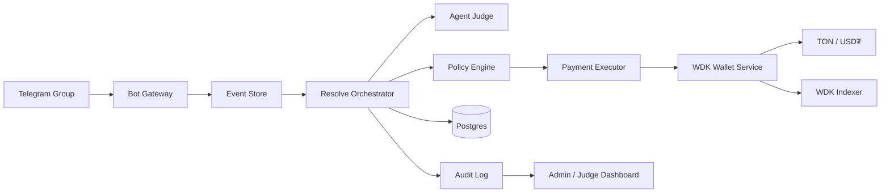
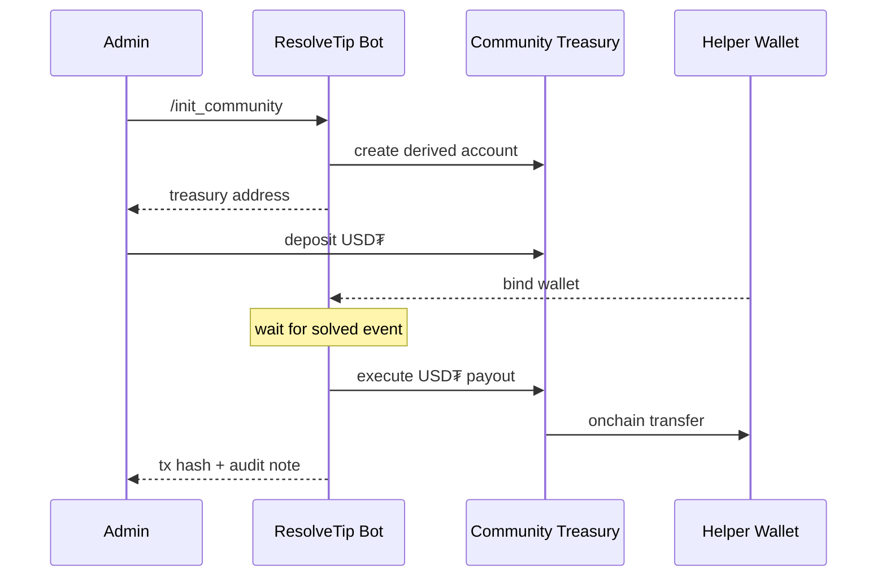
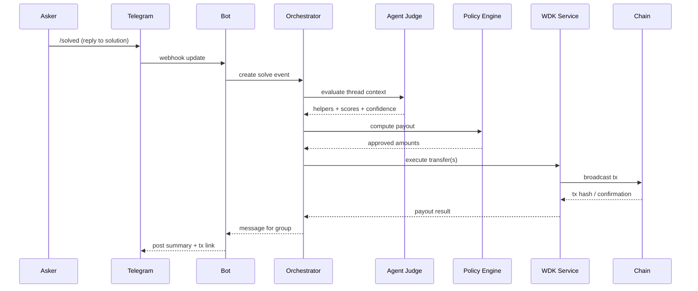
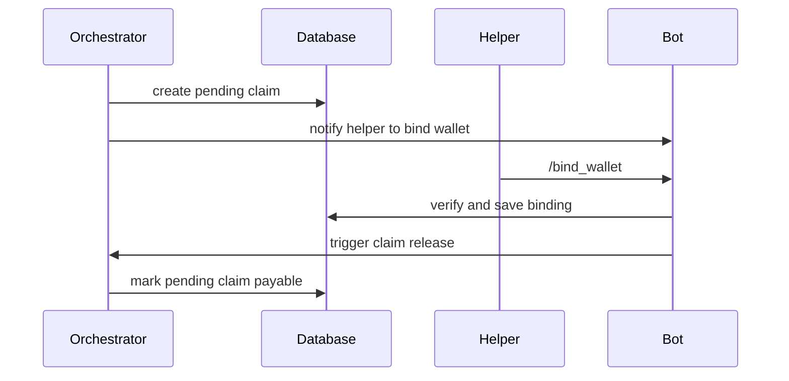

# ResolveTip — Proof-of-Help Tipping Agent

> 项目设计文档（PRD + Tech Spec + Build Plan）  
> Version: 0.1  
> Updated: 2026-03-18  
> 目标赛道：Tipping Bot  
> 默认技术路线：Telegram + TON + USD₮ + WDK

---

## 0. 文档目的

这份文档用于把 **ResolveTip** 从一个 hackathon idea 变成一个可直接开工的项目方案。它同时覆盖：

- 产品定义
- 核心用户流程
- 系统架构
- Agent 决策设计
- WDK 集成方案
- 数据模型
- API 与工程结构
- 安全与反作弊
- Demo 脚本与里程碑

文档默认读者是：

- 你自己（项目 owner / 全栈开发）
- 协作者（前端 / 后端 / AI / 合约）
- 黑客松评委

---

## 1. 项目一句话定义

**ResolveTip 是一个“Proof-of-Help Tipping Agent”——当社群里的问题被真正解决后，Agent 会自动识别真正提供帮助的人，并从项目金库向其链上发放 USD₮ 小费。**

核心表达：

> Builders define the rules → Agent verifies help → Value settles onchain

这和常见的打赏 bot 有本质区别：

- 不是谁最会刷存在感就拿钱
- 不是谁点赞最多就拿钱
- 不是管理员手动转账
- 而是 **“问题被解决” 这件事本身，触发自动链上结算**

---

## 2. 背景与问题定义

### 2.1 现有问题

在 Telegram / Discord / 开发者社群 / DAO 支持群里，真正有价值的劳动经常是：

- 帮新人排障
- 回答产品或技术问题
- 提供可执行的修复方案
- 深夜处理 support thread
- 让一个讨论真正走向 “solved”

这些行为常常：

- 没有标准化奖励
- 依赖管理员主观记忆
- 很少有人真的会手动去打赏
- 即使想奖励，也有支付路径、地址收集、金额判断等摩擦

### 2.2 本项目要解决的问题

**如何把“被验证的帮助”自动转换成链上微支付？**

ResolveTip 的回答是：

1. Builder 先设置奖励规则和预算
2. 社区成员照常交流
3. 当提问者确认“问题已解决”
4. Agent 分析上下文，识别帮助者
5. Policy Engine 决定是否可付、最多可付多少
6. WDK 钱包自动把 USD₮ 发给帮助者
7. 结果带交易凭证回帖，形成可审计记录

---

## 3. 为什么这条路线适合这次 Hackathon

这次 Hackathon 官方叙事强调的是：**agents as economic infrastructure**，项目不是为了讨论热度，而是围绕 **correctness、autonomy、real-world viability** 来评估。[^hackathon-theme]

ResolveTip 与这个方向天然匹配：

- **Correctness**：奖励触发条件是“问题是否真的被解决”
- **Autonomy**：从识别帮助者到执行结算，全流程自动完成
- **Real-world viability**：任何在线支持社群都能接入，不局限于 GitHub

它比“PR merge 自动奖励”更像一个通用经济基础设施，因为它奖励的是 **帮助行为本身**，而不是某个平台上的单一事件。

---

## 4. 项目目标

### 4.1 核心目标

MVP 的目标不是做一个功能很多的机器人，而是完成一个 **极强、极清楚、极可演示** 的闭环：

1. 管理员配置规则与预算
2. 用户绑定自己的收款钱包
3. 提问者通过 `/solved` 触发结算
4. Agent 自动识别 1~3 个真实帮助者
5. WDK 自动执行链上 USD₮ 转账
6. Bot 回帖说明金额、原因与交易链接

### 4.2 非目标

以下内容不是 MVP 必需项：

- 多链同时上线
- 复杂收益管理（如闲置资金生息）
- 声誉积分系统
- NFT 勋章 / 排行榜
- 复杂合约治理
- 完整客服后台

### 4.3 成功指标

Hackathon 期间建议用以下指标定义成功：

- 完成 1 个真实 Telegram 群的接入
- 成功执行 >= 3 笔自动 tip
- 从 `/solved` 到链上到账 < 30 秒
- 至少支持 1 个“多人协作分账”场景
- 每一笔打赏均可在系统中回溯原因和链上交易

---

## 5. 用户角色

### 5.1 社群管理员（Builder / Treasury Owner）

职责：

- 创建社群 treasury
- 设置奖励规则
- 为 treasury 充值 USD₮
- 查看预算和打赏历史

### 5.2 提问者（Asker）

职责：

- 在群中提问
- 在问题被解决后使用 `/solved`
- 对误判结果进行申诉或撤销（可选）

### 5.3 帮助者（Helper）

职责：

- 在群中回答问题
- 绑定收款地址
- 接收 Agent 自动结算的 USD₮

### 5.4 ResolveTip Agent

职责：

- 读取上下文
- 识别帮助者
- 生成贡献分配建议
- 执行策略检查
- 发起链上支付
- 记录审计日志

### 5.5 评委 / 审计者

职责：

- 验证系统不是手动打赏
- 查看每笔 tip 的触发依据
- 查看链上结算真实性

---

## 6. 产品定义与核心原则

### 6.1 核心原则

#### 原则 A：Proof of Help

只奖励“让问题走向解决”的帮助，不奖励纯陪聊、灌水、刷表情。

#### 原则 B：Policy First, AI Second

AI 不应该拥有无限资金控制权。AI 负责“识别与建议”，而真正的资金边界由策略层控制。

#### 原则 C：Self-Custodial Treasury

资金控制应建立在自托管钱包基础上。WDK 官方将其定位为一个面向 humans、machines 和 AI agents 的开源、多链、自托管钱包工具包。[^wdk-welcome]

#### 原则 D：Auditable by Default

每一笔 tip 都必须可回溯：

- 谁触发
- 基于哪些消息
- 为什么给这些人
- 计算出的金额是多少
- 对应哪笔链上交易

---

## 7. MVP 产品范围

### 7.1 默认链与资产

**默认链：TON**  
**默认资产：USD₮**

原因：

- Telegram 场景天然适合聊天内支付
- WDK 官方提供 `@tetherto/wdk-wallet-ton-gasless` 模块，支持 TON 上的 gasless 交易、paymaster 与 Jetton 资产转账；同时支持多账户管理。[^wdk-ton-gasless][^wdk-ton-usage]
- WDK Indexer 官方文档显示目前支持在 TON 上查询 USD₮ 余额与转账历史。[^wdk-indexer]

### 7.2 MVP 平台

- Telegram Supergroup / Topic 为主
- Bot 通过 webhook 接收消息和命令

### 7.3 MVP 功能列表

必须做：

1. `/init_community` 初始化社群
2. `/set_policy` 配置奖励规则
3. `/bind_wallet` 绑定收款地址
4. `/treasury` 查看 treasury 地址与余额
5. `/solved` 触发自动评估与打赏
6. Bot 回帖显示：收款人、金额、理由、交易链接
7. 审计页 / 管理页（最简）查看历史记录

可选增强：

- `/unsolved` 在 5 分钟内撤回
- 多人分账
- 无地址用户的 pending claim
- 每周导出奖励报告

---

## 8. 产品体验设计

### 8.1 管理员初始化

```text
/admin adds bot to group
-> /init_community
-> bot creates treasury account for this community
-> bot returns TON treasury address
-> admin deposits USD₮
-> /set_policy base_tip=2 max_tip=5 daily_budget=100 confidence=0.75
```

### 8.2 用户绑定钱包

```text
/helper sends /bind_wallet
-> bot returns secure binding link
-> user opens mini page
-> user connects TON wallet
-> backend verifies wallet ownership
-> binding saved
```

### 8.3 提问-解答-结算主流程

```text
asker asks a question
helpers reply
asker replies /solved on the resolution message
bot collects thread context
agent identifies true helpers
policy engine computes payout
wallet service sends USD₮
bot posts result + tx link
```

### 8.4 无地址场景

如果帮助者尚未绑定钱包：

- 该笔奖励先进入 `pending_claim`
- Bot 提醒对方绑定地址领取
- 超时未领取则奖励返还 treasury

> 说明：为了保持自托管路线，MVP 不建议替用户自动生成并托管钱包。更合理的做法是要求用户绑定自己控制的钱包，系统仅负责验证所有权并发放奖励。

---

## 9. 系统架构



### 9.1 模块划分

#### A. Bot Gateway

负责：

- 接收 Telegram webhook
- 解析命令、reply context、message metadata
- 生成内部事件

#### B. Event Store

负责：

- 记录原始消息事件
- 给后续 Agent 分析提供上下文
- 支持幂等去重

#### C. Resolve Orchestrator

负责：

- 驱动完整工作流
- 聚合消息上下文
- 调用 Agent Judge
- 调用 Policy Engine
- 调用 Payment Executor

#### D. Agent Judge

负责：

- 从消息上下文中判断是否“真的解决了问题”
- 找出 1~3 个真正有帮助的人
- 为每个帮助者生成贡献得分
- 给出解释性摘要

#### E. Policy Engine

负责：

- 检查预算、单次上限、冷却时间、置信度阈值
- 把 AI 给出的“贡献评分”转换成具体 USD₮ 金额
- 拒绝不合规 payout

#### F. Payment Executor

负责：

- 构造待签名支付任务
- 做幂等检查
- 交由 WDK 执行链上转账

#### G. WDK Wallet Service

负责：

- 管理 treasury 钱包
- 派生社群子账户
- 查询余额
- 执行 USD₮ 转账
- 查询交易历史

#### H. Audit / Dashboard

负责：

- 展示每次 tip 的输入、输出、理由和交易 hash
- 给评委看“系统是如何自动判断的”

---

## 10. WDK 集成方案

### 10.1 为什么选 WDK

WDK 官方当前明确提供：

- 统一的多链钱包编排能力 `@tetherto/wdk`[^wdk-core]
- TON Gasless 模块 `@tetherto/wdk-wallet-ton-gasless`[^wdk-ton-gasless]
- EVM ERC-4337 模块 `@tetherto/wdk-wallet-evm-erc4337`[^wdk-concepts]
- TRON gas-free 模块[^wdk-concepts]
- Indexer API，用于余额、转账和历史查询[^wdk-indexer]

这意味着你的项目可以：

- 先用 TON 做出最强 demo
- 再逐步扩展到 EVM / TRON
- 在不推翻架构的前提下切换多链结算

### 10.2 WDK 在本项目中的使用方式

#### 用法 1：单主种子 + 多社群派生 treasury

WDK Core 支持使用一个 seed phrase 初始化，然后通过 `getAccount(blockchain, index?)` 按 index 派生账户；文档也说明 `getAccountByPath()` 支持按派生路径获取账户。[^wdk-core-api]

本项目建议：

- 1 个 root seed（放在安全环境）
- 每个 community 使用 1 个独立 `hd_index`
- treasury 地址通过 `wdk.getAccount('ton', hdIndex)` 派生得到

这样做的好处：

- 部署简单
- 每个社群资金逻辑隔离
- 仍保持单一 root secret 管理

#### 用法 2：TON Gasless 转账

TON gasless 模块支持：

- BIP-39 seed phrase
- TON BIP-44 派生路径
- 多账户管理
- Gasless transaction
- Paymaster integration
- Jetton token balance / transfer[^wdk-ton-gasless][^wdk-ton-usage]

这正适合 tip 场景，因为：

- 收款人不需要持有原生 gas token 才能体验到打赏结果
- 小额支付的链上 UX 更顺畅

#### 用法 3：Indexer 做审计与余额展示

WDK Indexer 官方说明其提供多链的余额、token transfer 和交易历史查询能力。[^wdk-indexer]

本项目可用它做：

- treasury 余额展示
- 单用户收款历史查询
- 对账页
- Demo 时展示“Agent 确实完成了链上支付”

#### 用法 4：进程退出时清理敏感数据

WDK Core API 文档说明 `dispose()` 用于销毁钱包与账户并清理敏感数据。[^wdk-core-api]

MVP 要求：

- 服务优雅退出时调用 `wdk.dispose()`
- seed 不写入日志
- seed 不回传前端

### 10.3 推荐代码形态

```ts
import WDK from '@tetherto/wdk'
import WalletManagerTonGasless from '@tetherto/wdk-wallet-ton-gasless'

const wdk = new WDK(process.env.WDK_SEED_PHRASE!)
  .registerWallet('ton', WalletManagerTonGasless, {
    // ton client / api / paymaster / token config
  })

export async function getCommunityTreasuryAccount(hdIndex: number) {
  return await wdk.getAccount('ton', hdIndex)
}
```

> 说明：具体配置字段以你接入的 WDK 版本与所选 paymaster 配置为准；文档结构和模块能力以官方文档为准。[^wdk-ton-gasless][^wdk-core-api]

---

## 11. Treasury 与资金模型

### 11.1 资金模型选择

MVP 采用：

- **社群独立 treasury**
- **直接转账结算**
- **不使用复杂自定义合约**

原因：

- Hackathon 时间短
- 直接展示 Agent 自主结算更重要
- WDK 已提供足够强的钱包与转账基础设施

### 11.2 资金流



### 11.3 是否需要合约

**MVP：不需要。**  
原因是直接转账已经足够说明 Agent Wallet + Rule Engine + Onchain Settlement 的闭环。

**可选增强（V1.1 / EVM 版）**：

- 增加 `TipPolicyVault` 合约
- 把每日上限、单次上限、授权执行者写死在链上
- Agent 只负责发起策略内的 payout

但这不是当前 MVP 必需项。

---

## 12. Agent 决策系统设计

### 12.1 核心思想

Agent 不直接“拍脑袋决定金额”。  
Agent 只负责做三件事：

1. 这次 thread 是否真的 solved
2. 谁是真正的帮助者
3. 每个人贡献占比是多少

具体金额由 **Policy Engine** 依据规则计算。

### 12.2 输入数据

Agent Judge 的输入：

- `community_policy`
- asker 的原问题
- `/solved` 触发的 message id
- 最近 N 条相关消息
- reply chain / topic 上下文
- 候选帮助者列表
- 用户绑定钱包状态
- 历史冷却 / abuse 信号

### 12.3 输出 JSON 规范

```json
{
  "resolved": true,
  "confidence": 0.89,
  "resolution_score": 82,
  "helpers": [
    {
      "telegram_user_id": "12345",
      "message_ids": [101, 104],
      "contribution_score": 70,
      "share_percent": 70,
      "reason": "给出了可执行步骤并最终定位问题"
    },
    {
      "telegram_user_id": "67890",
      "message_ids": [103],
      "contribution_score": 30,
      "share_percent": 30,
      "reason": "补充了关键配置点"
    }
  ],
  "abuse_flags": [],
  "summary": "问题因网络配置错误导致；A 提供排查路径，B 补充关键参数，最终问题解决。"
}
```

### 12.4 金额计算不交给 LLM

金额由策略层计算：

```text
total_tip_usdt = clamp(
  min_tip,
  max_tip,
  round(base_tip * (0.5 + resolution_score / 100), 1)
)
```

例如：

- `base_tip = 2.0`
- `min_tip = 0.5`
- `max_tip = 5.0`
- `resolution_score = 82`

则：

- `total_tip = round(2.0 * 1.32, 1) = 2.6`

再按 `share_percent` 分账：

- helper A：1.82 USDT
- helper B：0.78 USDT

> 可以进一步做 0.1 USDT 精度 rounding。

### 12.5 决策约束

Agent 输出必须经过以下 deterministic checks：

- `resolved == true`
- `confidence >= confidence_threshold`
- `helpers.length >= 1`
- `helpers.length <= max_helpers`
- `share_percent` 总和 = 100
- 每个 helper 都不是 asker 自己
- 每个 helper 都不是 bot 自己
- 每个 helper 都完成 wallet binding（否则进入 pending claim）
- 未超过 daily budget
- 未触发 cooldown
- 未与历史 payout 冲突

### 12.6 推荐 Prompt 思路

系统提示要强调：

- 只根据 thread 内容判断
- 不能因为语气热情就给分
- 必须找到“导致问题解决”的证据
- 输出必须是严格 JSON
- 若无足够证据，返回 `resolved=false`

---

## 13. Policy Engine 设计

### 13.1 策略字段

建议每个社区都有一份独立 policy：

```yaml
community_id: tg_123
chain: ton
asset: USDT
enabled: true
base_tip: 2.0
min_tip: 0.5
max_tip: 5.0
max_helpers: 3
confidence_threshold: 0.75
daily_budget: 100.0
per_user_daily_limit: 10.0
pair_cooldown_hours: 24
allow_pending_claims: true
require_asker_trigger: true
exclude_admins: false
exclude_bots: true
```

### 13.2 关键策略规则

#### 规则 1：必须由 asker 触发

只有提问者本人使用 `/solved`，系统才进入结算流程。

#### 规则 2：禁止自问自答领赏

如果 asker 与 helper 是同一人，直接拒绝。

#### 规则 3：预算先于支付

若当日预算不足：

- 可以拒绝
- 或按剩余额度支付

MVP 推荐：**直接拒绝**，逻辑更清晰。

#### 规则 4：冷却时间

同一 asker-helper 对，在 24 小时内最多结算一次。

#### 规则 5：低置信度不支付

如果 Agent 没把握，就不付款；宁可少付，也不要错付。

---

## 14. 数据模型设计

建议使用 **PostgreSQL + Prisma**。

### 14.1 表结构总览

#### `communities`

| 字段 | 类型 | 说明 |
|---|---|---|
| id | string | 社群 ID |
| platform | string | telegram |
| chat_id | string | Telegram chat id |
| title | string | 群名 |
| hd_index | int | 对应 treasury 派生 index |
| status | string | active / paused |
| created_at | datetime | 创建时间 |

#### `reward_policies`

| 字段 | 类型 | 说明 |
|---|---|---|
| id | string | policy id |
| community_id | string | 关联社群 |
| chain | string | ton |
| asset | string | USDT |
| base_tip | decimal | 基础金额 |
| min_tip | decimal | 最小金额 |
| max_tip | decimal | 最大金额 |
| daily_budget | decimal | 日预算 |
| confidence_threshold | decimal | 置信度阈值 |
| max_helpers | int | 最大帮助者数 |
| pair_cooldown_hours | int | asker-helper 冷却 |
| allow_pending_claims | bool | 是否允许待领取 |
| updated_at | datetime | 更新时间 |

#### `wallet_bindings`

| 字段 | 类型 | 说明 |
|---|---|---|
| id | string | 绑定记录 |
| platform_user_id | string | Telegram user id |
| chain | string | ton |
| address | string | 收款地址 |
| ownership_verified | bool | 是否完成所有权验证 |
| verified_at | datetime | 验证时间 |

#### `threads`

| 字段 | 类型 | 说明 |
|---|---|---|
| id | string | thread id |
| community_id | string | 社群 |
| asker_user_id | string | 提问者 |
| root_message_id | string | 起始消息 |
| status | string | open / solved / paid / rejected |
| created_at | datetime | 创建时间 |

#### `thread_messages`

| 字段 | 类型 | 说明 |
|---|---|---|
| id | string | 内部消息 id |
| thread_id | string | 关联 thread |
| platform_message_id | string | Telegram 消息 id |
| platform_user_id | string | 发言者 |
| reply_to_message_id | string | reply 关系 |
| content | text | 文本内容 |
| created_at | datetime | 时间 |

#### `solve_events`

| 字段 | 类型 | 说明 |
|---|---|---|
| id | string | solve event id |
| thread_id | string | 关联 thread |
| trigger_user_id | string | 触发者 |
| trigger_message_id | string | /solved 所在消息 |
| idempotency_key | string | 幂等键 |
| status | string | queued / evaluated / paid / rejected |
| created_at | datetime | 时间 |

#### `agent_decisions`

| 字段 | 类型 | 说明 |
|---|---|---|
| id | string | decision id |
| solve_event_id | string | 关联 solve event |
| resolved | bool | 是否 solved |
| confidence | decimal | 置信度 |
| resolution_score | int | 解决度评分 |
| helpers_json | jsonb | 帮助者及占比 |
| abuse_flags_json | jsonb | 风险信号 |
| summary | text | 解释摘要 |
| model_name | string | 所用模型 |
| created_at | datetime | 时间 |

#### `tip_events`

| 字段 | 类型 | 说明 |
|---|---|---|
| id | string | tip 事件 |
| solve_event_id | string | 来源事件 |
| community_id | string | 社群 |
| total_amount | decimal | 总金额 |
| asset | string | USDT |
| chain | string | ton |
| status | string | created / broadcasting / confirmed / failed |
| created_at | datetime | 时间 |

#### `tip_transfers`

| 字段 | 类型 | 说明 |
|---|---|---|
| id | string | transfer id |
| tip_event_id | string | 归属 tip |
| recipient_user_id | string | 帮助者 |
| recipient_address | string | 地址 |
| amount | decimal | 金额 |
| tx_hash | string | 链上 hash |
| status | string | pending / confirmed / failed |
| created_at | datetime | 时间 |

#### `audit_logs`

| 字段 | 类型 | 说明 |
|---|---|---|
| id | string | 审计日志 |
| entity_type | string | solve_event / tip_event / payout |
| entity_id | string | 对象 ID |
| action | string | evaluate / approve / reject / broadcast |
| details_json | jsonb | 明细 |
| created_at | datetime | 时间 |

---

## 15. 幂等、可靠性与任务队列

### 15.1 幂等键设计

每个 `/solved` 事件必须有唯一幂等键：

```text
idempotency_key = {community_id}:{thread_root_message_id}:{trigger_message_id}
```

如果同一事件重复到达：

- 不重复评估
- 不重复打款
- 直接返回已存在结果

### 15.2 队列设计

推荐使用：

- Redis + BullMQ

队列拆分：

- `message-ingest`
- `solve-evaluate`
- `payout-execute`
- `tx-confirmation`

### 15.3 状态机

```text
queued -> evaluating -> policy_checked -> payout_created -> broadcasting -> confirmed
```

失败路径：

```text
queued -> evaluating -> rejected
queued -> evaluating -> policy_failed
broadcasting -> failed
```

---

## 16. API 设计

### 16.1 Telegram Webhook

`POST /webhooks/telegram`

职责：

- 接收 Telegram update
- 解析 command / message / reply
- 推入消息处理队列

### 16.2 初始化社区

`POST /api/communities/init`

请求：

```json
{
  "chat_id": "-100123456",
  "title": "WDK Builders CN",
  "platform": "telegram"
}
```

响应：

```json
{
  "community_id": "comm_001",
  "treasury_address": "ton://...",
  "hd_index": 12,
  "status": "active"
}
```

### 16.3 更新策略

`PUT /api/communities/:communityId/policy`

```json
{
  "base_tip": 2.0,
  "min_tip": 0.5,
  "max_tip": 5.0,
  "daily_budget": 100,
  "confidence_threshold": 0.75,
  "max_helpers": 3,
  "pair_cooldown_hours": 24
}
```

### 16.4 绑定钱包

`POST /api/wallets/bind/start`

```json
{
  "platform_user_id": "12345",
  "chain": "ton"
}
```

返回签名 challenge / connect session。

### 16.5 触发 solved

`POST /api/solve-events`

```json
{
  "community_id": "comm_001",
  "thread_id": "thread_100",
  "trigger_user_id": "12345",
  "trigger_message_id": "9001"
}
```

### 16.6 查询 tip 历史

`GET /api/communities/:communityId/tips`

### 16.7 查询 treasury

`GET /api/communities/:communityId/treasury`

返回：

- treasury 地址
- 当前余额
- 今日已发金额
- 剩余预算

---

## 17. Telegram 交互命令设计

### 管理员命令

- `/init_community`
- `/set_policy`
- `/pause_tipping`
- `/resume_tipping`
- `/treasury`
- `/budget`

### 用户命令

- `/bind_wallet`
- `/my_wallet`
- `/solved`
- `/unsolved`
- `/my_tips`

### Bot 自动回复示例

```text
✅ Resolved and rewarded

Helpers:
- @alice — 1.8 USD₮
- @bob — 0.8 USD₮

Why:
Alice provided the main troubleshooting steps and identified the root cause.
Bob added the missing configuration detail.

TX:
0xabc123...
```

---

## 18. 钱包绑定与所有权验证

### 18.1 为什么不能只让用户发一个地址

如果用户只输入地址，系统无法证明：

- 这个地址真的是他控制的
- 他是不是盗用别人的地址

### 18.2 推荐绑定流程

生产方案：

1. 用户点击 `/bind_wallet`
2. 打开一个最小 web page / mini app
3. 用户连接 TON 钱包
4. 后端生成 challenge
5. 钱包完成签名或等效所有权证明
6. 后端验证通过后保存绑定记录

### 18.3 Hackathon Demo 退化方案

如果时间不够：

- 使用管理员预先登记的地址名单
- 或使用一次性 challenge + 用户手动确认

但在演示时要明确说明：

> Demo 为了压缩接入成本，绑定流程做了轻量化；生产版会升级为正式的钱包所有权验证。

---

## 19. 安全与反作弊设计

### 19.1 资金安全

- root seed 仅存储在服务端安全环境
- 不写入数据库
- 不写入日志
- 服务关闭时调用 `wdk.dispose()` 清理内存中的敏感数据[^wdk-core-api]
- 任何 payout 必须先过 Policy Engine

### 19.2 行为反作弊

- 禁止 asker 给自己打赏
- 同一对 ask-user / helper-user 设冷却时间
- 同一 thread 只能 payout 一次
- 低置信度不付款
- 超预算不付款
- 同一 helper 单日上限
- 帮助者数量上限
- 检测“互刷 solved”模式并标记风险

### 19.3 误判控制

- Agent 只给结构化评分，不直接任意决定金额
- 金额由 deterministic formula 计算
- 输出摘要保存在审计日志
- 可选支持 `/unsolved` 撤销窗口

### 19.4 可解释性

每笔 tip 至少要能显示：

- 哪条问题被认定已解决
- 哪几条回复被视为关键帮助
- 贡献分数与分账比例
- 最终金额
- 对应交易 hash

---

## 20. 工程结构建议

推荐使用 **TypeScript Monorepo**：

```text
resolvetip/
  apps/
    api/
    bot/
    admin/
  packages/
    agent-judge/
    policy-engine/
    wallet-service/
    audit-core/
    db/
    shared-types/
  prisma/
  scripts/
  docs/
```

### 20.1 技术栈建议

- Backend: Node.js + TypeScript + Fastify
- Telegram: Telegraf
- DB: PostgreSQL + Prisma
- Queue: Redis + BullMQ
- Admin UI: Next.js
- AI: provider adapter（OpenAI / Gemini / Claude 均可）
- Wallet: WDK

### 20.2 核心包职责

#### `agent-judge`

- prompt 构造
- response schema 校验
- 贡献评分输出

#### `policy-engine`

- rule validation
- tip amount calculation
- budget checks

#### `wallet-service`

- WDK 初始化
- treasury 账户派生
- 余额查询
- 发起转账
- 查询确认状态

#### `audit-core`

- 日志格式标准化
- 决策快照持久化

---

## 21. 关键业务流程时序图

### 21.1 Solved → Evaluate → Payout



### 21.2 无钱包绑定场景



---

## 22. 伪代码示例

### 22.1 处理 `/solved`

```ts
async function handleSolvedEvent(input: SolveInput) {
  const thread = await threadRepo.getContext(input.threadId)
  const policy = await policyRepo.getByCommunity(input.communityId)

  assertAskerIsTriggerUser(thread.askerUserId, input.triggerUserId)
  assertNotAlreadyPaid(input.idempotencyKey)

  const decision = await agentJudge.evaluate({ thread, policy })

  const payout = policyEngine.compute({
    policy,
    decision,
    askerUserId: thread.askerUserId,
  })

  if (!payout.approved) {
    await audit.logReject(input, decision, payout)
    return { status: 'rejected', reason: payout.reason }
  }

  const transfers = await walletService.sendTipTransfers({
    communityId: input.communityId,
    recipients: payout.recipients,
    asset: policy.asset,
    chain: policy.chain,
  })

  await audit.logSuccess(input, decision, payout, transfers)
  return { status: 'paid', transfers }
}
```

### 22.2 计算金额

```ts
function computeTip(policy: Policy, decision: AgentDecision): PayoutDecision {
  if (!decision.resolved) return reject('not_resolved')
  if (decision.confidence < policy.confidenceThreshold) return reject('low_confidence')

  const total = clamp(
    policy.minTip,
    policy.maxTip,
    round(policy.baseTip * (0.5 + decision.resolutionScore / 100), 1)
  )

  const recipients = normalizeShares(decision.helpers).map((h) => ({
    userId: h.telegramUserId,
    amount: round(total * (h.sharePercent / 100), 1),
  }))

  return approve({ total, recipients })
}
```

---

## 23. 测试计划

### 23.1 单元测试

- `policyEngine.compute()`
- `normalizeShares()`
- `budget/cooldown checks`
- `anti self-tip logic`

### 23.2 集成测试

- `/solved` 后完整工作流
- 无钱包绑定时 pending claim
- 重复 webhook 幂等处理
- 多人分账

### 23.3 对抗测试

- asker 自己回答自己
- 两个账号互刷 solved
- 无效地址绑定
- 同一事件重复触发
- 低置信度输出

### 23.4 Demo 测试清单

在正式录 demo 前至少跑通：

1. 初始化 treasury
2. 充值显示余额
3. 两位 helper 分账
4. 一笔 pending claim
5. `/unsolved` 或 reject case

---

## 24. Demo 剧本（建议 2 分钟）

### 场景

- 社群：`WDK Builders CN`
- Admin 已充值 treasury
- Alice 提问
- Bob 与 Carol 回复
- Alice 使用 `/solved`

### 演示步骤

1. 展示 `/treasury` 和余额
2. 展示 Alice 的问题和 Bob/Carol 的帮助消息
3. Alice 回复 `/solved`
4. Bot 显示 “Evaluating…”
5. 15~30 秒内，Bot 回帖：
   - Bob 1.8 USD₮
   - Carol 0.8 USD₮
   - 原因摘要
   - tx hash
6. 打开简单 dashboard：
   - thread 内容
   - Agent 决策 JSON
   - payout 明细
   - 链上结果

### Demo 重点台词

- “这不是手动打赏。”
- “金额不是 LLM 随便决定的，而是策略层算出来的。”
- “资金来自自托管 treasury，Agent 在约束下自动执行。”
- “这说明在线帮助行为可以被即时、可审计地链上结算。”

---

## 25. 与现有 TipAgent 类项目的差异化

| 维度 | PR Reward Agent | ResolveTip |
|---|---|---|
| 触发事件 | PR merged | 问题被解决 |
| 平台 | GitHub | Telegram / 社群 |
| 奖励对象 | 开源贡献者 | 帮助者 / support responder |
| 价值判断 | 代码贡献 | 问题解决贡献 |
| 场景 | 开源 repo | DAO、开发者群、客服群、教育社群 |
| 经济意义 | 代码奖励 | 在线帮助劳务市场 |

一句话差异：

**它奖励的不是“被 merge 的代码”，而是“被验证的帮助”。**

---

## 26. Roadmap

### Phase 1：MVP（Hackathon 必做）

- Telegram Bot 接入
- Community Treasury 初始化
- Policy 配置
- Wallet Binding
- `/solved` -> Agent Evaluate -> WDK Payout
- Audit Page

### Phase 2：增强版

- Pending claim 自动释放
- Weekly summary
- Better anti-abuse heuristics
- 多语言 thread 识别

### Phase 3：多链版

- 扩展到 EVM
- 使用 WDK 的 ERC-4337 模块做 gasless payout[^wdk-concepts]
- 引入合约化 policy vault

### Phase 4：平台化

- Discord 接入
- Forum / ticket system 接入
- SDK for communities

---

## 27. 开发里程碑建议（按 hackathon 冲刺）

### Day 1

- 建库与 monorepo scaffold
- Telegram bot 跑通
- DB schema 定义
- `/init_community` 与 `/treasury`

### Day 2

- WDK TON wallet service 接入
- treasury 派生与余额查询
- wallet binding 基础流程

### Day 3

- `/solved` 触发
- thread context 聚合
- Agent Judge JSON 输出

### Day 4

- Policy Engine
- 实际 USD₮ 打款
- tx hash 回帖

### Day 5

- Audit dashboard
- 幂等 / 失败重试
- 录制 demo

---

## 28. 最小可交付代码清单

Hackathon 交付最少应包含：

- 可运行 bot
- README
- 环境变量说明
- 架构图
- 一段真实 demo 视频
- 至少一笔测试链 / 主网演示支付
- 审计页或日志页

建议仓库必须有：

```text
README.md
.env.example
/docker-compose.yml
/apps/bot
/apps/api
/packages/wallet-service
/packages/policy-engine
/packages/agent-judge
```

---

## 29. 风险与开放问题

### 风险 1：Telegram thread 结构不总是干净

解决思路：

- MVP 依赖 reply chain / topic
- 只截取最近 N 条相关消息

### 风险 2：LLM 误判谁是真正帮助者

解决思路：

- 限制输出结构
- 加置信度阈值
- 金额由策略层决定
- 低置信度直接不付款

### 风险 3：钱包绑定 UX 过重

解决思路：

- 先做最轻量可验证绑定
- demo 中可预绑定 2~3 个演示账户

### 风险 4：Gasless / paymaster 配置时间不足

解决思路：

- 保留 TON + WDK 主路线
- 如配置受阻，可临时切换到普通转账方式完成 demo
- 但文档与 roadmap 保留 gasless 设计目标

---

## 30. 最终对外 Pitch 文案

### 一句话

**ResolveTip is a proof-of-help tipping agent that automatically rewards the real problem-solvers in online communities with onchain USD₮ payouts.**

### 30 秒版

ResolveTip turns online help into an auditable micro-labor market.  
Builders fund a self-custodial treasury once and define payout rules.  
When a support thread is actually solved, the agent identifies the real helpers, computes a policy-safe reward, and settles USD₮ onchain automatically through WDK.

### 评委视角要点

- 不是“聊天打赏”
- 是“被验证帮助后的自动结算”
- 不是单点 demo
- 是一个可复制到任何社群的经济基础设施模块

---

## 31. 推荐 README 结构

未来你写仓库 README 时，可以直接沿用：

1. What is ResolveTip?
2. Why it matters
3. How it works
4. Architecture
5. WDK integration
6. Setup
7. Environment variables
8. Demo flow
9. Security assumptions
10. Roadmap

---

## 32. 结论

如果你要在 Tipping Bot 赛道做一个 **明显区别于 PR Reward Agent** 的作品，ResolveTip 是一条非常强的路线，因为它：

- 问题定义完全不同
- 更贴近社群真实劳动
- 更符合 “agent as economic infrastructure” 的主题[^hackathon-theme]
- 更能体现 WDK 的自托管、多账户、gasless、多链扩展能力[^wdk-welcome][^wdk-ton-gasless][^wdk-concepts][^wdk-indexer]

**最重要的不是“让机器人能转账”，而是证明：在线帮助行为可以被 AI 在约束下识别，并由自托管 Agent Wallet 自动结算。**

---

## 附录 A：环境变量建议

```bash
NODE_ENV=development
PORT=3000
DATABASE_URL=postgres://...
REDIS_URL=redis://...
TELEGRAM_BOT_TOKEN=...
TELEGRAM_WEBHOOK_SECRET=...
WDK_SEED_PHRASE=...
WDK_INDEXER_API_KEY=...
TON_API_KEY=...
LLM_API_KEY=...
APP_BASE_URL=https://...
```

---

## 附录 B：Agent 输出 Zod Schema（示意）

```ts
import { z } from 'zod'

export const AgentDecisionSchema = z.object({
  resolved: z.boolean(),
  confidence: z.number().min(0).max(1),
  resolutionScore: z.number().int().min(0).max(100),
  helpers: z.array(
    z.object({
      telegramUserId: z.string(),
      messageIds: z.array(z.number().int()),
      contributionScore: z.number().int().min(0).max(100),
      sharePercent: z.number().min(0).max(100),
      reason: z.string(),
    })
  ).max(3),
  abuseFlags: z.array(z.string()),
  summary: z.string(),
})
```

---

## 附录 C：官方参考

[^hackathon-theme]: Hackathon 页面公开描述强调：agents as economic infrastructure，以及以 correctness、autonomy、real-world viability 为主要评估方向。参见 DoraHacks / Eventbrite 公开页面摘要：<https://dorahacks.io/hackathon/hackathon-galactica-wdk-2026-01>，以及 Eventbrite 搜索结果摘要。  
[^wdk-welcome]: WDK 官方首页：WDK 是开源、多链、自托管的钱包开发工具包，面向 humans、machines 和 AI agents。<https://docs.wdk.tether.io/>  
[^wdk-core]: WDK Core GitHub README：统一管理钱包与协议模块，支持 EVM、TON、Bitcoin、TRON、Solana 等模块。<https://github.com/tetherto/wdk>  
[^wdk-concepts]: WDK Concepts：官方说明支持 `@tetherto/wdk-wallet-evm-erc4337`、`@tetherto/wdk-wallet-ton-gasless`、`@tetherto/wdk-wallet-tron-gasfree` 等账户抽象 / gasless 模块。<https://docs.wdk.tether.io/resources-and-guides/concepts>  
[^wdk-ton-gasless]: WDK TON Gasless 模块概览：支持 BIP-39、TON derivation path、多账户管理、gasless transaction、paymaster integration、Jetton 支持。<https://docs.wdk.tether.io/sdk/wallet-modules/wallet-ton-gasless>  
[^wdk-ton-usage]: WDK TON Gasless Usage：支持多账户、余额查询、原生转账与 Jetton gasless transfer。<https://docs.wdk.tether.io/sdk/wallet-modules/wallet-ton-gasless/usage>  
[^wdk-indexer]: WDK Indexer API：提供余额、token transfers、交易历史查询；当前文档列出支持 TON 上的 USD₮。<https://docs.wdk.tether.io/tools/indexer-api>  
[^wdk-core-api]: WDK Core API Reference：`getAccount(blockchain, index?)`、`getAccountByPath()`、`dispose()` 等接口说明。<https://docs.wdk.tether.io/sdk/core-module/api-reference>
